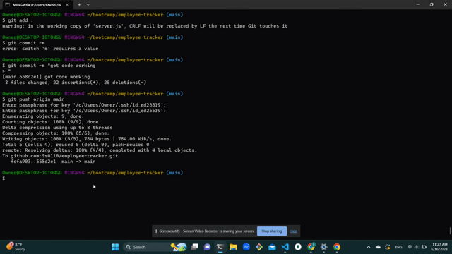

# ORM Challenge: E-commerce Back End

This project is a back-end application for an e-commerce website. It utilizes the latest technologies to provide a robust and scalable solution for managing products, categories, and tags. The application is built using Express.js and Sequelize, and it interacts with a MySQL database.

The objective of this project is to create a functional Express.js API and configure it to use Sequelize for database operations. The application allows the manager of an internet retail company to efficiently manage their e-commerce website and compete with other e-commerce companies.

## Table of Contents

- [Installation](#installation)
- [Usage](#usage)
- [Database Configuration](#database-configuration)
- [Schema and Seed](#schema-and-seed)
- [Starting the Application](#starting-the-application)
- [API Routes](#api-routes)
- [Walkthrough Video](#walkthrough-video)
- [Contributing](#contributing)
- [License](#license)
- [Questions](#questions)

## Installation

To install the necessary dependencies, run the following command:

```
 npm install
```

## Usage

This application provides a powerful back-end for an e-commerce website. It can be customized and integrated with a front-end application to create a complete e-commerce platform. The back-end provides the necessary API routes to manage categories, products, and tags.

## Database Configuration

Before running the application, you need to set up the database configuration. Create a `.env` file in the root directory of the project and add the following environment variables:

```
DB_NAME=your_database_name
DB_USER=your_mysql_username
DB_PASSWORD=your_mysql_password
```

Replace `your_database_name`, `your_mysql_username`, and `your_mysql_password` with your actual MySQL database credentials.

## Schema and Seed

To create the database tables and seed them with test data, run the following command:

```
npm run seed
```

This command will execute the `schema.sql` file to create the necessary database schema and seed the tables with sample data.

## Starting the Application

To start the application, run the following command:

```
npm start
```

The server will start running and the Sequelize models will be synced to the MySQL database.

## API Routes

The following API routes are available in the application:

- **Categories**

  - `GET /api/categories`: Get all categories
  - `GET /api/categories/:id`: Get a single category by ID
  - `POST /api/categories`: Create a new category
  - `PUT /api/categories/:id`: Update a category by ID
  - `DELETE /api/categories/:id`: Delete a category by ID

- **Products**

  - `GET /api/products`: Get all products
  - `GET /api/products/:id`: Get a single product by ID
  - `POST /api/products`: Create a new product
  - `PUT /api/products/:id`: Update a product by ID
  - `DELETE /api/products/:id`: Delete a product by ID

- **Tags**
  - `GET /api/tags`: Get all tags
  - `GET /api/tags/:id`: Get a single tag by ID
  - `POST /api/tags`: Create a new tag
  - `PUT /api/tags/:id`: Update a tag by ID
  - `DELETE /api/tags/:id`: Delete a tag by ID

Make sure to use an API testing tool like Insomnia Core to test these routes and perform CRUD operations on the database.

## Walkthrough Video

Please refer to the [walkthrough video](https://youtu.be/H9RKeh4fE3c) for a demonstration of the application's functionality.



## License

This project is licensed under the [MIT License](LICENSE).

## Questions

If you have any questions, please feel free to contact me:

GitHub:https://github.com/Ss0110/orm-challenge

Email: saraysanchez01@yahoo.com
